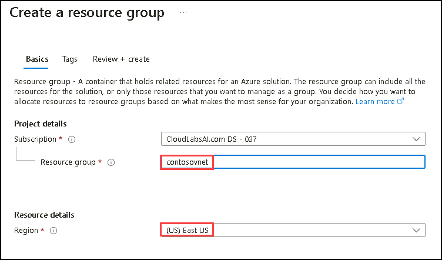
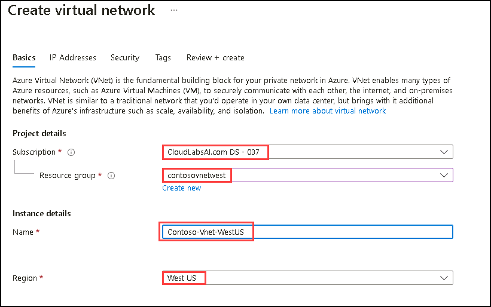
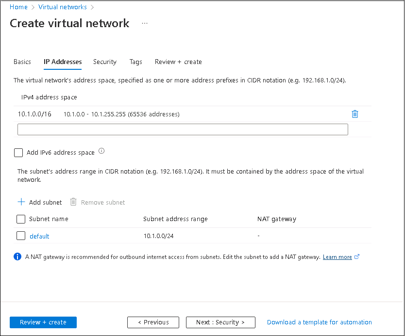
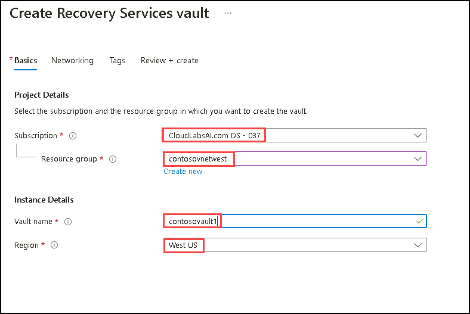

# Instructions

## Exercise 1: Setup Azure Site Recovery 

In this exercise, you are going to deploy a Azure site recovery. Azure Site Recovery offers disaster recovery and resilience for apps and workloads running on on-premises machines or Azure IaaS VMs. When there is an outage, Site Recovery orchestrates replication and handles failover to Azure. It also handles Azure recovery to your primary site.

### Prerequisites
-Presence of: 
+ One resource group in **East US** region.
+ One resource group in **West US** region.

#### Steps:

1. Search for **Resource groups** on the **search** box of the **Home** page, then select **Resource groups** from the list below.
2. On the **Resource groups** page, select **+ Create** to create a new resource group.
3. In the **Create a resource group** page under the **Basics** tab, enter the following details and click on **Review+Create**.

    | Section | Values |
    | ------- | ------ |
    | Subscription | **Default** Select the default subscription |
    | Resource group | **contosovnet** |
    | Region | **(US)EastUS** |
    
    

4. Select the **Create** button and wait for the resource group to be created.
5. Repeat steps 1-4 to create the second resource group with the follwing details:

    | Section | Values |
    | ------- | ------ |
    | Subscription | **Default** Select the default subscription |
    | Resource group | **contosovnetwest** |
    | Region | **West US** |

### In this exercise, you will:

+ Task 1: Create a two Virtual Networks.
+ Task 2: Create two Virtual Machines.
+ Task 3: Create a Recovery Services Vault and enable Replication.

### Estimated Timing: 60 minutes

### Task 1: Create two virtual networks

In this task you are going to create two virtual networks. One will be in the West US region and the other will be in the East US region.

1. In Azure portal, search for **Virtual networks**, then select **Virtual networks** from the list below.

2. Select the **+ Create** on the **Virtual networks** page.

    
  
3. On the **Create virtual network** page, enter the following details on **Basics** tab:

    | Section | Values |
    | ------- | ------ |
    | Subscription | **Default** Select the default subscription |
    | Resource group | **contosovnetwest** |
    | Name | **Contoso-Vnet-WestUS** |
    | Region | **West US** |
  
    
  
4. Go to **Next: IP Addresses**, on the **IP Addresses** tab, review the default IP addresses and subnet given, then select **Review + Create**.
  
    
  
5. Once the validation is passed successfully, click on **Create**.   
 
6. After completion of deployment, select **Go to resource**.

7. Repeat steps 2-5 to create another virtual network into the same resource group with the following information:

   **Second Virtual Network:**
  
    | Section | Values |
    | ------- | ------ |
    | Name | **Contoso-Vnet-EastUS** | 
    | Resource group | **contosovnet** |
    | Region | **East US** |
    
   For the **IP Addresses** tab keep the default settings.
   
   After completing this task, two virtual networks will be present in the Resource group.

### Task 2: Create two Virtual Machines

In this task, you will learn how to use Azure portal to create two virtual machines

#### Steps

1. In Azure portal, search for **Virtual machines**, then select **Virtual machines** from the list.

2. On the Virtaul machines page, select **+ Create**, then select **Azure virtual machine**.

    
  
3. On the **Create a Virtual machine** page, enter the following details on the **Basics** tab:

    | Section | Values |
    | ------- | ------ |
    | Subscriptioon | Select the default subscription |
    | Resource group | **contosovnet** |
    | Virtual machine name  | **contoso-vm-1** |
    | Region | **East US** |
    | Availability options | **No infrastructure redundancy required** |
    | Security type | **Standard** |
    | Image | **Windows Server 2019 Datacenter - x64 Gen2** |
    | VM architecture | **x64** |
    | Size | **Standard_DS1-V2 - 1 -vcpu, 3.5 Gib memory** |
    | Username | **contosoadmin** |
    | Password | **Pa$$w0rd123!** | 

 4. Keep the default options for rest of the settings on the Basics tab and select **Next: Disks>** at the bottom. Select **Standard SSD(Locally-redundant storage)** for **OS disk type**, then click on **Next: Networking>** at the bottom.

    
    
5. On the **Networking** tab, review all the default settings and the values, also notice default value of **Virtual network** as **Contoso-Vnet-EastUS**, then select **Review + create** at the bottom.

6. After validation is passed, click on **Create**.

7. Once the deployment is succeeded, select **Go to resource**.

8. Repeat steps 2-6 to create another Virtual machine with name **contoso-vm-2**.
   
After completing this task, two Virtual machines named **contoso-vm-1** and **contoso-vm-2** will be present in the Resource group.

### Task 3: Create a Recovery Services Vault

In this task you are going to a Recovery service vault.

#### Steps:

1. In Azure portal, search for **Recovery Service Vaults** and then select **Recovery Services vaults** from the list.

2. On the **Recovery Services vaults** page, select **+ Create**.

    

3. On the **Create Recovery Services vault** page, enter the following details on the **Basics** tab.
    
    | Section | Values |
    | ------- | ------ |
    | Subscriptioon | Select the default subscription |
    | Resource group | **contosovnetwest** |
    | Vault Name | **contosovault1** |
    | Region | **West US** |
    
      
    
4. Select **Review + create**, and then click on **Create**. 
    
5.  Click on **Go To Resource** to open the vault for further configuration.

6.  On the **contosovault1** page, at the **Overview** section, select **+ Enable Site Recovery**.

      
    
7. On the **Site Recovery** section, select **Enable replication** under **Azure virtual machines**.

        
    
8. On the **Enable replication** page, select the **Resource group** as **contosovnet** and then click on **Next**.

        

9. Select **contoso-vm-1** under **Virtual machines** tab and then click on **Next**.

      

10. On the **Replication settings** tab, review the default settings and the values, then select **Next**. 

     

11. On the **Manage** tab, review the default settings and the values, then select **Next**

     

12. On the **Review** tab, select **Enable replication**.

    

13. It will take 5-7 minutes to complete the replication. Select **Replicated items** on **contosovault1** page. You can see the Virtual machine enabled for replication. Please keep refreshing as the status of replicated Virtual machine should be **0% Synchronized**.

14. Replication of **contoso-vm-2** is also need to be enabled. For this, repeat steps 6-12. However under the **Virtual machines** tab of the **Enable Replication** page ensure to check **contoso-vm-2**.

You have successfully enabled the replication for **contoso-vm-1**. Replication will take 10-15 minutes to complete, so in next exercise you will be setting up the traffic manager for the webapp and in exercise three you will continue to failover the VMs in secondary region.

#### Review

In this exercise, you have:

- Created a Virtual network
- Created two Virtual Machines.
- Created a Recovery Services Vault and enable Replication.
