# Instructions

## Exercise 4: Setup Azure SQL Database disaster recovery

In this exercise, you are going to set up active geo-replication for Azure SQL Database using the Azure portal, as well as how to initiate failover.

In this exercise, you will:

+ Task 1: Create an Azure SQL database with Adventure Works pre-loaded.
+ Task 2: Add a Secondary database.
+ Task 3: Initiate a failover.

### Estimated Timing: 60 minutes

### Task 1: Create an Azure SQL database with Adventure Works pre-loaded

In this task, you will learn how to use Azure portal to create a single database with Adventure works sample database

#### Steps

1. Login into Azure portal and on the search box type SQL database, then please select the **SQL database** option from the list.

    

2. Please select the **+ Create** button.

    

3. Under **Basic** tab, please enter the following details:

    | Settings | Values |
    |  -- | -- |
    | Subscription | **Use default supplied** |
    | Resource group | **Select the resource group name ODL-AZ-305M03B-<inject key="Deployment-id"></inject> from the dropdown list** |
    | Database name | **AdventureWorksContoso** |
   
    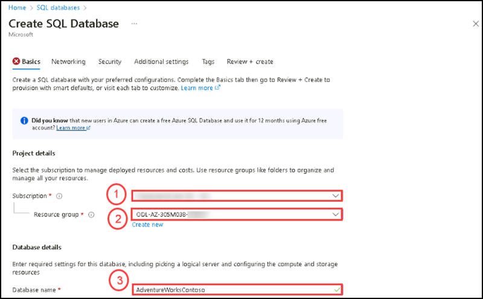 

4. For server, click **Create new**.

    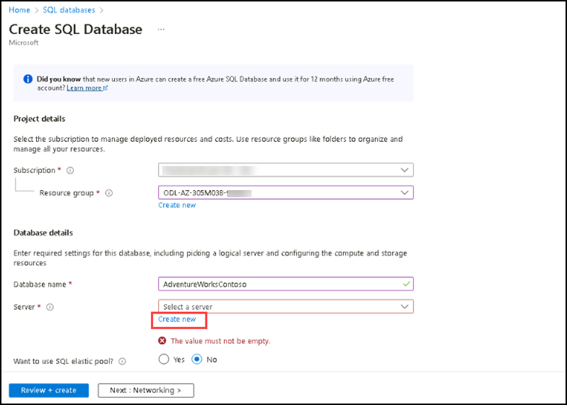 

5. On **Create SQL Database Server** page, please enter the following details and click on **Ok**

    | Settings | Values |
    |  -- | -- |      
    | Server name | **contososerv** |
    | Location | **East US** |
    | Authentication method | **Use SQL authentication** |
    | Server admin login | **contosoadmin** 
    | Password |  **Contoso@123** 
    | Confirm password | **Contoso@123** |    
    
         

6. After creating the database server, please enter the following and click on **Next : Networking >**

    | Settings | Values |
    |  -- | -- |      
    | Server name | **contososerv** |
    | Want to use SQL elastic pool? | **No** |    |
    | Compute + storage | **General Purpose (Standard-series (Gen5), 2 vCores, 32 GB storage, zone redundant disabled)** |
    | Backup storage redundancy |  **Geo-redundant backup storage** |
    
     

7. On the **Networking** tab, review the default settings.

8. Select **Next: Security** at the bottom of the page, then keep the default settings as it is.

9. Select **Next: Additional settings** at the bottom of the page.

10. On the **Additional settings** tab, in the **Data source** section, select **Sample** for Use existing data and click **Ok** on the **AdventureWorksLT** dialogue box. Instead of an empty blank database, this creates an AdventureWorksLT sample database with tables and data to query and experiment with.

    

11. After selecting AdventureWorksLT sample database, please select **Review + Create**.

    

12. After validation is completed successfully, please select **Create**.

13. Once the deployment is complete, please select **Go to Resource**.

14. You have succesfully created the **AdventureWorksContoso** database.

### Task 2: Add a Secondary database

In this task, you will learn how to use Azure portal to add a secondary database. You must be the subscription owner or co-owner to add a secondary database. 
The secondary database has the same name as the primary database and the same service tier and compute size by default. The secondary database can be either a single or a pooled database. Data begins replicating from the primary database to the new secondary database once the secondary is created and seeded.

#### Steps

1. Select the **AdventureWorksContoso** database, under **Data Management** select **Replicas**, then select **+ Create replica**.

    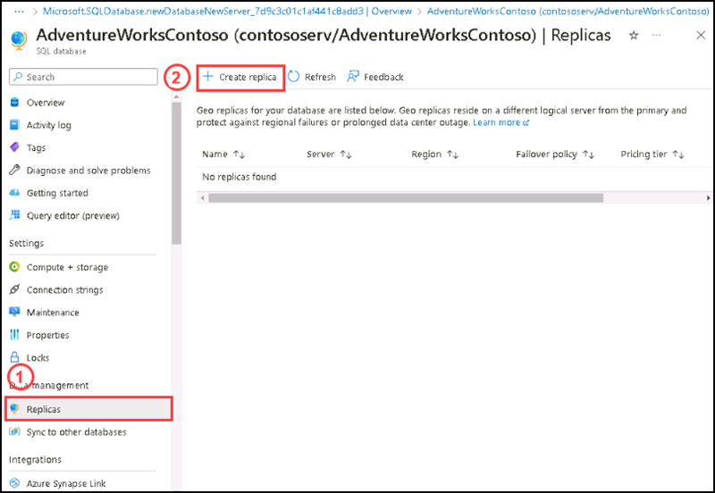

2. On the **Create SQL Database - Geo Replica** page under **Server** select **Create new**.

    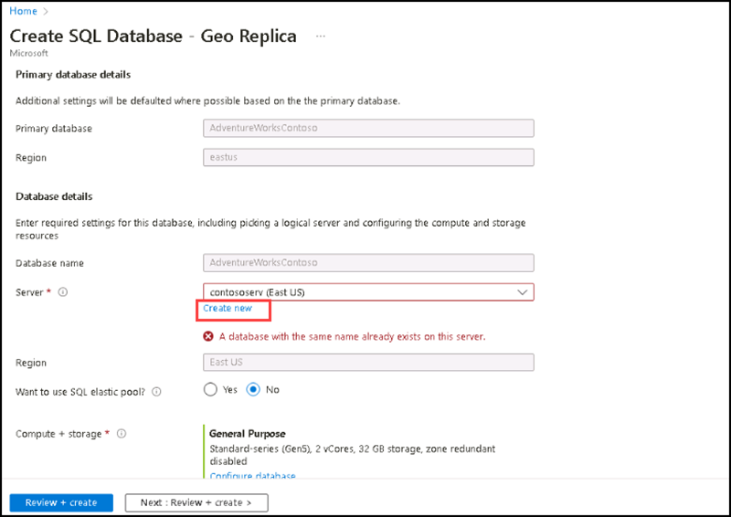

3. On the **Create Database server** page, enter the following details and then select **Ok**.

    | Settings | Values |
    |  -- | -- |      
    | Server name | **contososervwest** |
    | Location | **West US** |
    | Authentication method | **Use SQL authentication** |
    | Server admin login | **contosoadmin** 
    | Password |  **Contoso@123** 
    | Confirm password | **Contoso@123** |  
    
    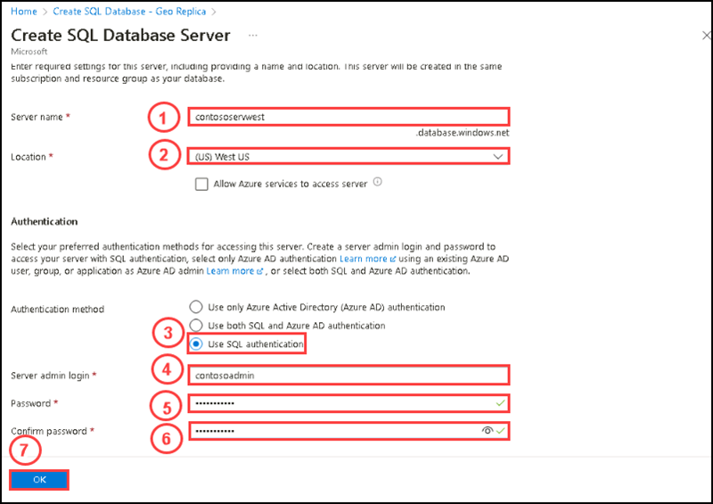

4. On the **Create SQL Database - Geo Replica** page keep the following settings as it is and then select **Review + create**.

    | Settings | Values |
    |  -- | -- |      
    | Server name | **contososervwest** |
    | Want to use SQL elastic pool? | **No** |    |
    | Compute + storage | **General Purpose (Standard-series (Gen5), 2 vCores, 32 GB storage, zone redundant disabled)** |
    | Backup storage redundancy |  **Geo-redundant backup storage** |
    
    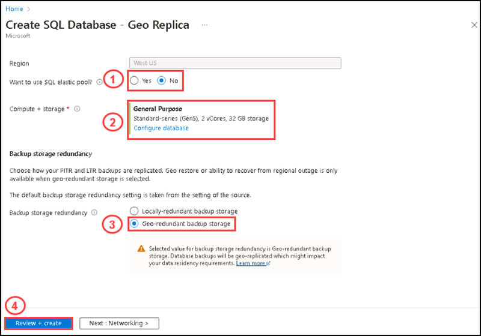
    
5. Select **Create**. The secondary database is created and the deployment process begins.

    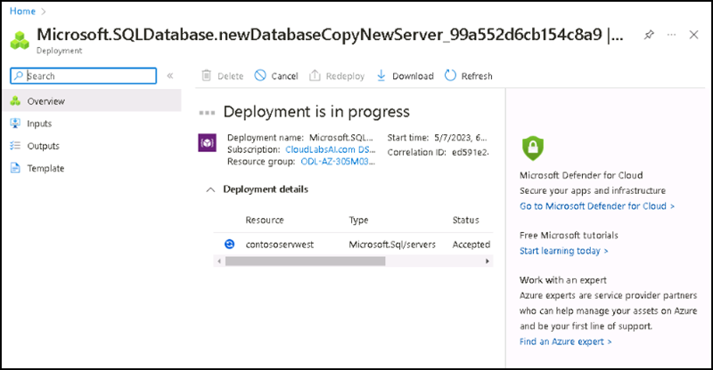
    
6. When the deployment is complete, the secondary database displays its status.

    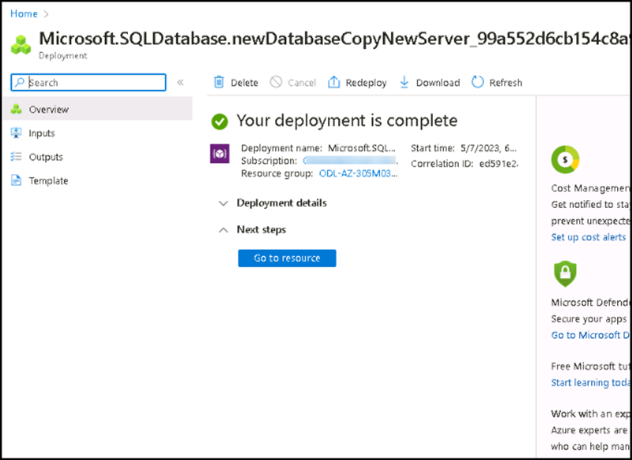
    
7. Return to the primary database page, and then select Replicas. Your secondary database is listed under Geo replicas.

    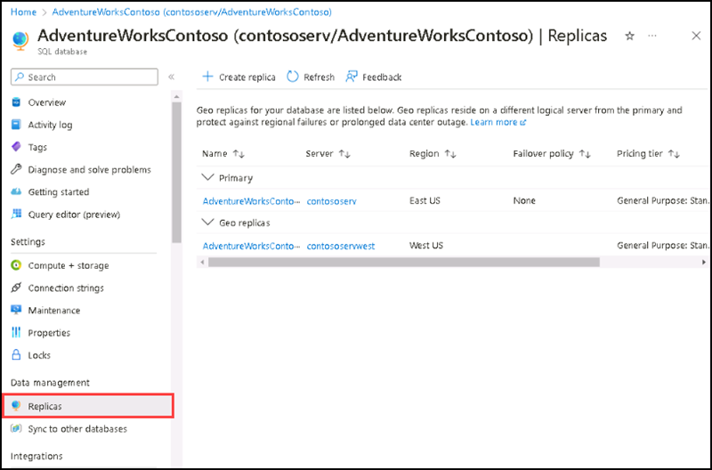

### Task 3: Initiate a failover

In this task, you will learn how to switch secondary database to become the primary.

#### Steps

1. In the Azure portal, browse to the primary database in the geo-replication partnership.

2. Scroll to Data management, and then select Replicas.

3. In the Geo replicas list, select the secondary database under **Geo replicas** to become the new primary, select the **ellipsis (...)**, and then select **Forced failover**.

    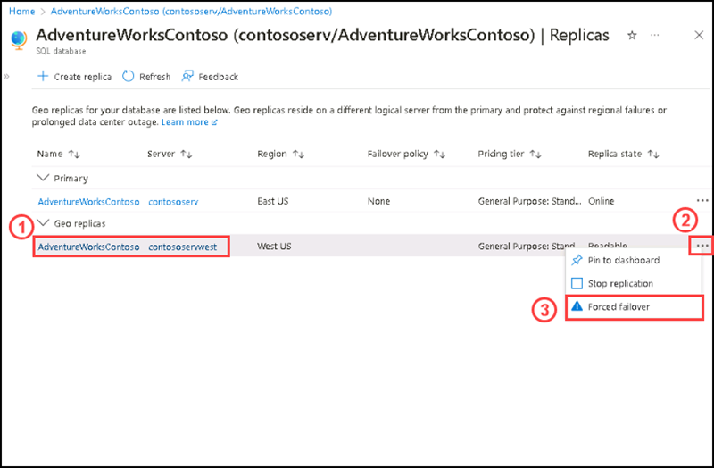
    
4. Select **Yes** to begin the failover.    

    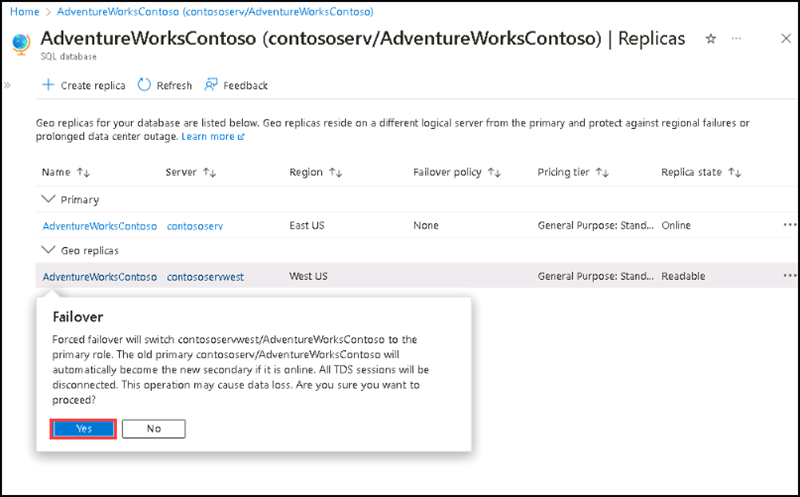

5. The command immediately switches the secondary database into the primary role. This process normally should complete within 30 seconds or less.

    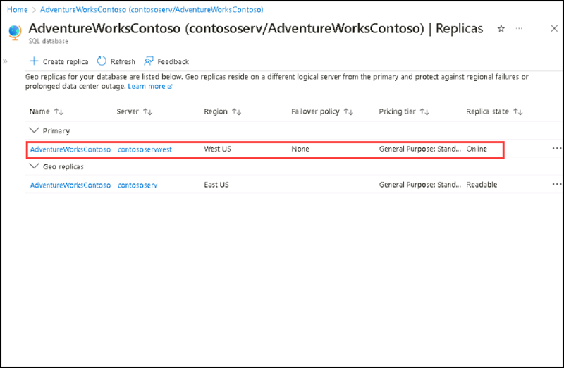
    
Both databases are unavailable for a short period of time, on the order of 0 to 25 seconds, while the roles are switched. If the primary database has multiple secondary databases, the command reconfigures the other secondary databases to connect to the new primary. Under normal conditions, the entire operation should take less than a minute to complete.
    
### Review

In this lab, you have: 
- Deployed an Azure SQL database.
- Added a Secondary database.
- Initiated a failover.
